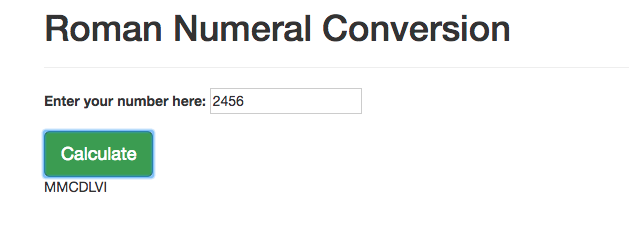

# _Roman Numeral Converter_

#### _Program to convert numbers into roman numerals, 8-18-2016_

#### By _**Kyle Lange and Stephen Newkirk**_

#### See it live [HERE](https://kylelange.github.io/Roman-Numeral-Converter/).

## Description

_This program asks users to enter a number into a field, converts the number into its equivalent in roman numerals and outputs the converted number to the ui._

## Specifications
_Return false if number is greater than 3,999._
* _Sample Input: 4000_
* _Sample Output: "Please enter a number below 4000."_

_Return a single digit # into corresponding Roman Numerals (including exceptions: 4,9)_
* _Sample Input:  3   4   9_
* _Sample Output: III IV  IX_

_Return the tens place # into corresponding Roman Numerals (including exceptions)_
* _Sample Input: 11 14 19_
* _Sample Output: XI XIV XIX_

_Return the hundreds place # into corresponding Roman Numerals (including exceptions)_
* _Sample Input: 101  114  119_
* _Sample Output: CI  CXIV CXIX_

_Return the thousands place # into corresponding Roman Numerals (including exceptions)_
* _Sample Input: 1011  1014  1019_
* _Sample Output: MI   MXIV  MXIX_

_Add the functions for each number's place to a loop that converts the individual numbers in each place._
* _Sample Input: 3999_
* _Sample Output: move to correct function_

## Setup/Installation Requirements

1. Download this repo using your terminal: git clone repo-name pasted here

2. View the code by drag-and-dropping the file into your [favorite text editor](https://atom.io)

3. run/check-out the program by dropping the index/html file from your folder into your web browser

## Known Bugs

_There are no known bugs as of the last commit. Please send an ISSUE on github in the repository if you see something I have not._

## Support and contact details

For questions, concerns, or suggestions please email baronsintrees@gmail.com

## Technologies Used

* HTML5
* CSS3
* JavaScript with jQuery 3.1

### License

*This program is licensed under the MIT license.*

Copyright (c) 2016 **_Kyle Lange, Stephen Newkirk_**
